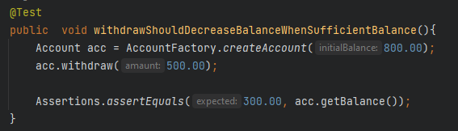

# Teste automatizado com JUnit

### Sobre o projeto:

Projeto Java criado para contexto de testes automatizados com JUnit, onde existe uma conta bancária com os métodos de Saque, Depósito, Saque total.

### Objetivo:

Compreender os fundamentos de testes unitários utilizando o framework JUnit, aplicar testes concisos dos cenários conforme descritos abaixo, a fim de validar o comportamento de unidades funcionais de código/métodos.

### Testes realizados:

- Verifica se o deposito incrementa o saldo quando entrar com um valor/quantidade positiva na conta:

- Verifica se o depósito não faz nada caso o valor depositado seja negativo.

- Verifica se o saldo será zerado ao realizar o saque total da conta.

- Verifica se ao sacar, decrementa o valor sacado  quando o saldo da conta estiver disponível.

- Verifica se o valor do saque excede o saldo disponível em conta gerando um exceção quando o saldo for insuficiente.

### Conteúdo de estudo:

https://devsuperior.com.br/java-spring-ultimate

### Desenvolvedora:

Giana Medeiros - https://www.linkedin.com/in/gianamedeiros/
